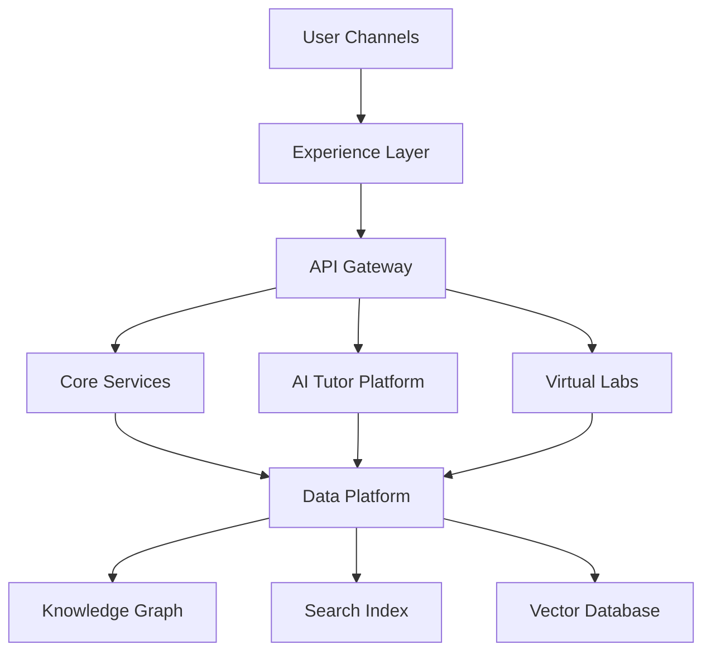
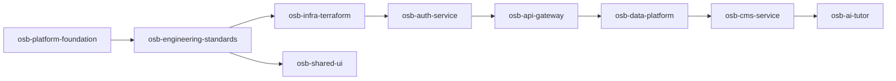

# Architecture Overview

## Architecture status

**Version:** Architecture v1.0  
**Status:** Frozen for implementation  
**Change control:** ADR required for material changes

## Platform layers

## Major systems

| System | Purpose |
|---|---|
| Web Platform | Public website, learning portal, SEO, PWA |
| Mobile Apps | Android/iOS learning, offline mode, flashcards |
| API Gateway | Unified client entry point |
| Auth Service | Identity, sessions, RBAC, OIDC/OAuth2 |
| CMS Service | Structured content, publishing, localization |
| AI Tutor | RAG-powered adaptive learning mentor |
| Data Platform | PostgreSQL, Neo4j, vector DB, search |
| Virtual Labs | Sandbox provisioning and lab assessment |
| Assessment Engine | Quizzes, exams, proctoring, rubrics |
| Certification Engine | Certificates, badges, learning passport |
| Marketplace | Creator, partner, course, and lab marketplace |
| Admin Portal | Operations, content, user, analytics management |

## Approved repository sequence

## Technology baseline

| Area | Preferred direction |
|---|---|
| Web | Next.js, React, TypeScript |
| Mobile | React Native / Expo |
| Backend | TypeScript services, Fastify where appropriate |
| Database | PostgreSQL / Supabase baseline |
| Knowledge Graph | Neo4j |
| Vector DB | Pinecone or approved equivalent |
| Search | Typesense or approved equivalent |
| Infra | Terraform/OpenTofu, Kubernetes, Cloudflare |
| CI/CD | GitHub Actions |
| Observability | OpenTelemetry, Prometheus, Grafana, central logging |

## Architecture governance

No implementation team may bypass:

- ADR process
- Security review
- Accessibility requirements
- Data protection review
- CI/CD quality gates
- Repository standards

